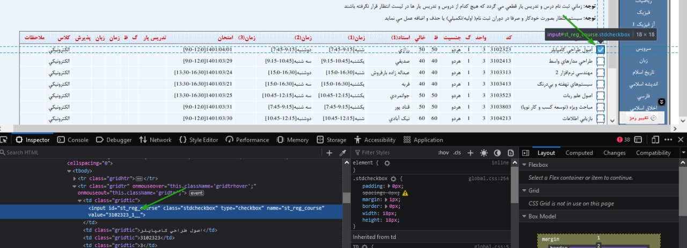

# AUT Portal Course Registerer

This script automates AUT course registration process. A sample driver script is provided below:

```python
from portal import Portal

p = Portal()
if p.login("9731xxx", "password", sleep_seconds=0.3):  # old portal login credentials
    # add courses to drop first
    p.add_drop_course("1040261_2__")  # میلایی

    # add courses to register
    p.add_reg_course("3103513_1__")  # هوش محاسباتی
    
    # trigger course registration
    p.do_course_selection()
```

Course codes can be obtained from the value attribute of courses' checkbox in the portal's courses list (check the image below).



`sleep_seconds` parameter is used to prevent 503 error before the registration starts.

> **Note**
> 
> This script was designed when portal didn't have single sign-on (new login) feature. I have changed it to work with the recent login flow changes, however, it doesn't work optimal.
> 
> Be extra careful with your username and password. The script doesn't report correct error if the credentials are wrong (due to login changes).

